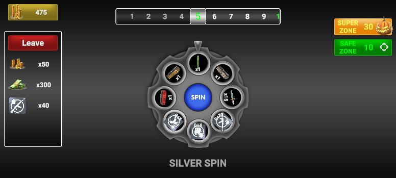
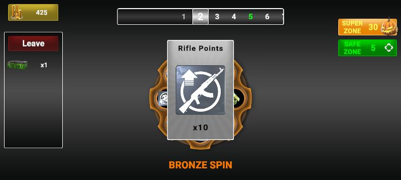
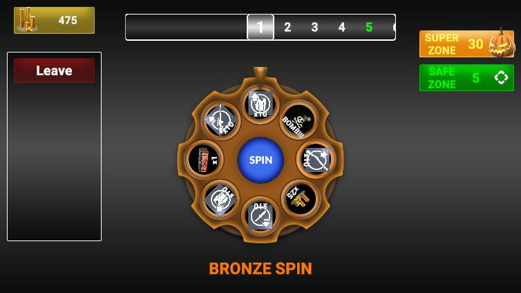
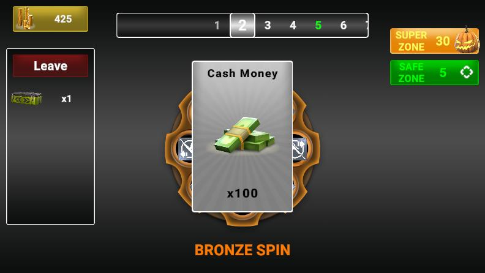
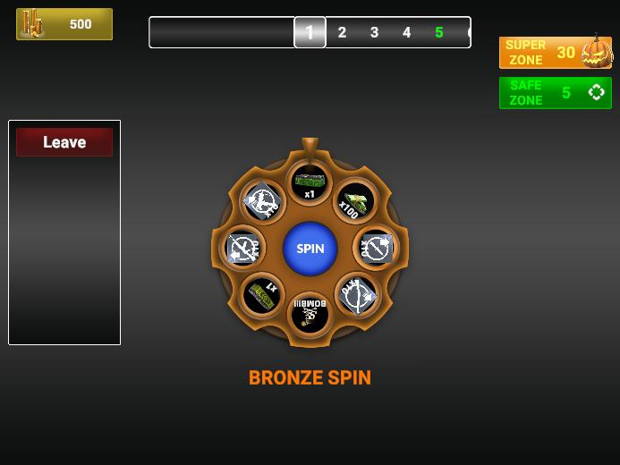

# Wheel of Fortune

A modular Wheel of Fortune game built with **Unity 2021 LTS**. The project focuses on clean architecture, responsive UI, and memory optimization.

## Architecture & Design

* **Architecture:** Event-Driven Architecture to decouple game logic from the UI.
* **Principles:** Applied **SOLID** principles, specifically Separation of Concerns.
* **Design Patterns:** Observer (for UI), Singleton (for Managers), and Dependency Injection.
* **Data Management:** Fully configurable game data using **ScriptableObjects**.
* **Optimization:** **Sprite Atlas** for reduced draw calls and efficient UI rendering.

## Features

* **Zone Logic:** Procedural generation of Safe, Super, and Standard zones.
* **Risk Mechanics:** Algorithmic guarantee of specific items to balance risk/reward.
* **Progression:** Persistent collect/leave mechanics.

---

## Screenshots

### 20:9 Aspect Ratio
| | | | |
|:---:|:---:|:---:|:---:|
|  |  |  |  |

### 16:9 Aspect Ratio
| | | | |
|:---:|:---:|:---:|:---:|
|  |  |  |  |

### 4:3 Aspect Ratio
| | | | |
|:---:|:---:|:---:|:---:|
|  |  |  |  |

---

## Gameplay

**[Watch Gameplay Video](https://youtu.be/XwD7f8XdNk0)**

## Test

Download the APK from [Releases](https://github.com/orkuneser/WheelFortuneSystem/releases/tag/V0.0.1).
